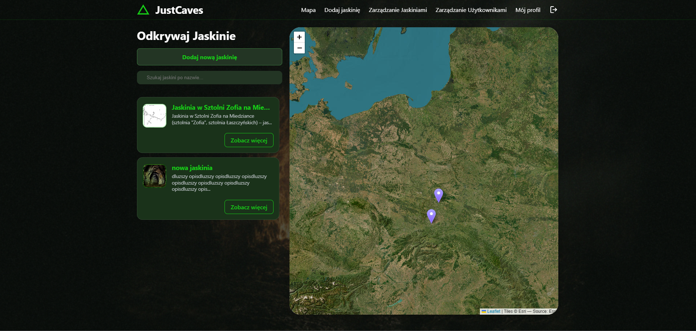
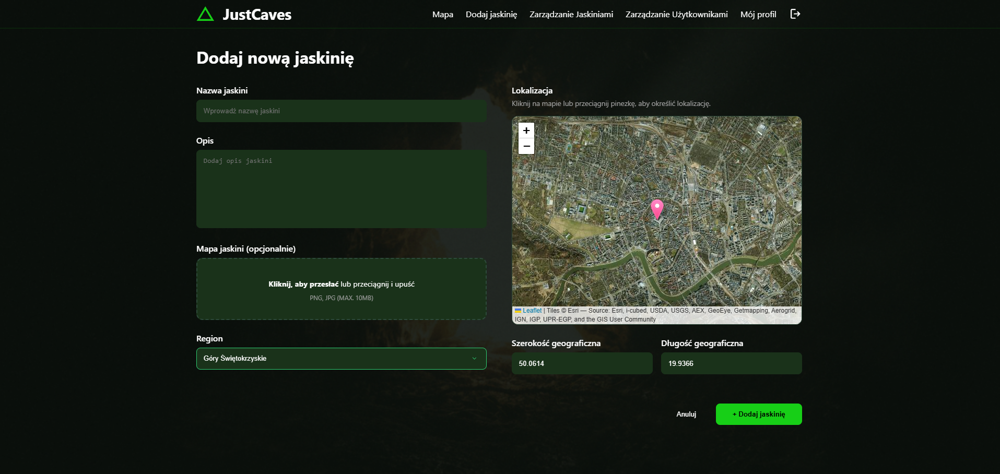
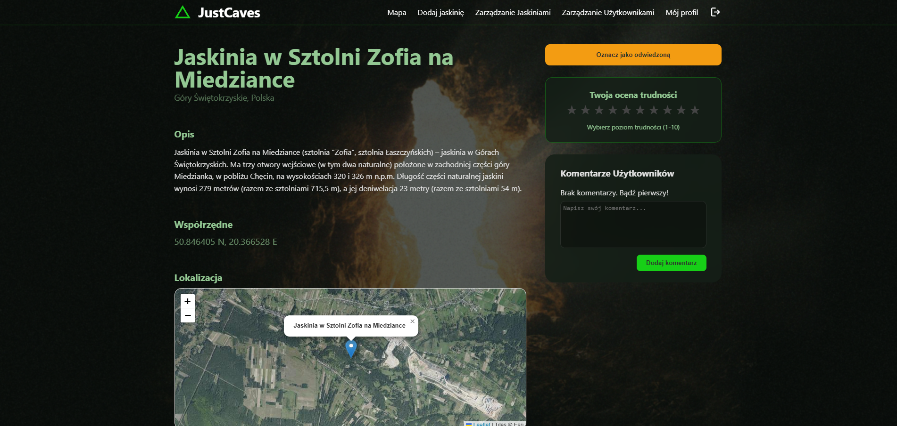
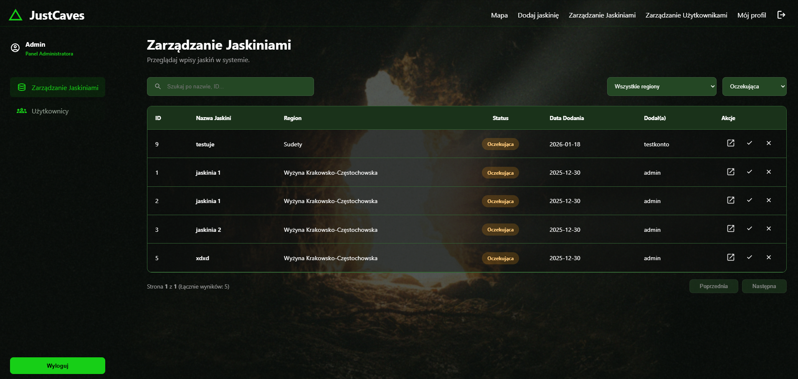
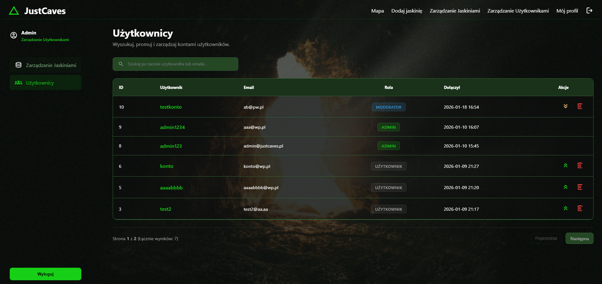
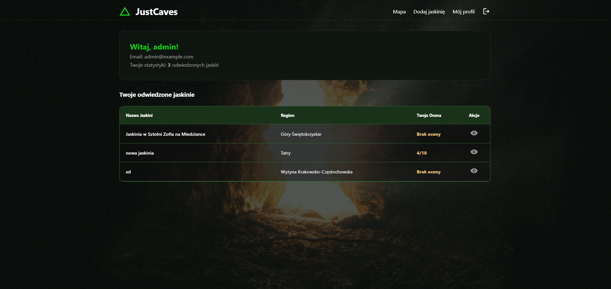
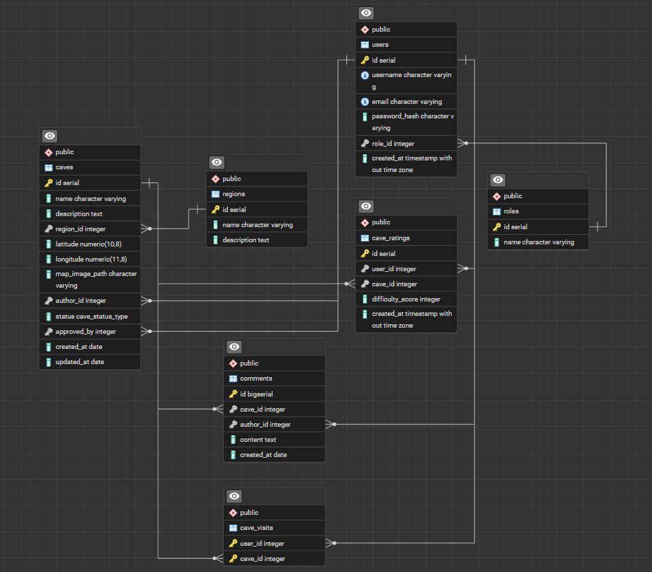

# JustCaves - System zarządzania jaskiniami w Polsce

## Spis treści

- [Opis projektu](#opis-projektu)
- [Architektura](#architektura)
- [Screenshoty](#screenshoty)
- [Struktura bazy danych](#struktura-bazy-danych)
- [Instalacja i uruchomienie](#instalacja-i-uruchomienie)
- [Scenariusz testowy](#scenariusz-testowy)
- [Funkcjonalności](#funkcjonalności)
- [Checklist wymagań](#checklist-wymagań)

---

## Opis projektu

**JustCaves** to aplikacja webowa umożliwiająca użytkownikom odkrywanie, dodawanie i zarządzanie informacjami o jaskiniach w Polsce. System oferuje interaktywną mapę, system komentarzy, ocen trudności oraz panel administracyjny.

### Główne funkcjonalności:

- Interaktywna mapa jaskiń (Leaflet.js)
- System użytkowników z rolami (User, Moderator, Admin)
- Dodawanie i moderowanie jaskiń
- System ocen trudności (1-10)
- Komentarze
- Oznaczanie odwiedzonych miejsc
- Responsywny design

---

## Architektura

### Architektura MVC

```
┌─────────────────────────────────────┐
│      WARSTWA PREZENTACJI            │
│  (Views - HTML/CSS/JS)              │
│  - admin/caves.php                  │
│  - admin/users.php                  │
│  - caves/addCave.php                │
│  - caves/cave_details.php           │
│  - caves/caves.php                  │
│  - error/404.html                   │
│  - login/login.php                  │
│  - login/register.php               │
│  - partials/navbar.php              │
│  - profile/profile.php              │
└─────────────────────────────────────┘
                 ▲
                 |
                 │
                 ▼
┌─────────────────────────────────────┐
│      WARSTWA KONTROLERÓW            │
│  (Controllers - Logika biznesowa)   │
│  - CavesController.php              │
│  - SecurityController.php           │
│  - AdminCavesController.php         │
│  - AdminUsersController.php         │
│  - AppController.php                │
│  - ProfileController.php            │
└─────────────────────────────────────┘
                 ▲
                 |
                 │
                 ▼
┌─────────────────────────────────────┐
│      WARSTWA MODELI                 │
│  (Models)                           │
│  - Cave.php                         │
│  - User.php                         │
└─────────────────────────────────────┘
                 ▲
                 |
                 │
                 ▼
┌─────────────────────────────────────┐
│      WARSTWA REPOZYTORIUM           │
│  (Repository - Dostęp do danych)    │
│  - CaveRepository.php               │
│  - UserRepository.php               │
│  - CommentRepository.php            │
│  - Repository.php                   │
└─────────────────────────────────────┘
                 ▲
                 |
                 │
                 ▼
┌─────────────────────────────────────┐
│      BAZA DANYCH                    │
│  (PostgreSQL)                       │
│  - Tabele (caves, users, etc.)      │
│  - Widoki (cave_statistics)         │
│  - Funkcje (get_region_stats)       │
│  - Wyzwalacze (update_timestamp)    │
└─────────────────────────────────────┘
```

### Routing

- `Routing.php` - mapowanie URL → Controller + Action
- `index.php` - punkt wejścia aplikacji

### Bezpieczeństwo

- Sesje (autentykacja i autoryzacja)
- Prepared Statements (SQL Injection)
- Password hashing (bcrypt)
- Role-based access control

---

## Screenshoty








---

## Struktura bazy danych

### Diagram ERD



### Widoki (Views)

#### `v_caves_details`

Pełne informacje o jaskiniach.

#### `v_user_activity`

Statystyki użytkowników

### Funkcje (Functions)

#### `get_cave_avg_rating(p_cave_id INT)`

Oblicza średnią ocenę jaskini.

### Wyzwalacze (Triggers)

#### `update_updated_at_column`

Automatycznie aktualizuje datę 'updated_at' przy modyfikacji.

## Instalacja i uruchomienie

### Wymagania

- **Docker**
- **Git**

### Krok 1: Klonowanie repozytorium

```bash
git clone https://github.com/andr0meda727/JustCaves.git
cd JustCaves
```

### Krok 2: Uruchomienie

```bash
docker-compose up --build
```

## Krok 3: Generowanie certyfikatu SSL (self-signed)

```bash
mkdir -p docker/nginx/ssl
openssl req -x509 -nodes -days 365 \
  -newkey rsa:2048 \
  -keyout docker/nginx/ssl/server.key \
  -out docker/nginx/ssl/server.crt \
  -subj "/CN=localhost"
```

## Krok 4: Uruchomienie kontenerów

```bash
docker compose up -d
```

### Krok 5: Import bazy danych

- Skopiuj plik backup.sql i utwórz bazę (np. poprzez pgAdmina)

### Krok 6: Dostęp do aplikacji

- **Aplikacja:** https://localhost:8443
- **PgAdmin:** http://localhost:5050

### Domyślne konto administratora

- **Login:** `admin1234`
- **Hasło:** `admin1234`

---

## Scenariusz testowy

### 1. Rejestracja i logowanie

#### 1.1 Rejestracja nowego użytkownika

1. Otwórz https://localhost:8443
2. Kliknij "Zarejestruj się"
3. Wypełnij formularz:
   - Username: `testuser`
   - Email: `test@example.com`
   - Password: `password123`
4. **Oczekiwany rezultat:** Przekierowanie na stronę logowania z komunikatem sukcesu

#### 1.2 Logowanie

1. Zaloguj się danymi: `testuser` / `password123`
2. **Oczekiwany rezultat:** Przekierowanie na `/caves` z dostępem do mapy

#### 1.3 Błędne logowanie

1. Spróbuj zalogować się: `testuser` / `wrongpassword`
2. **Oczekiwany rezultat:** Komunikat błędu "Nieprawidłowa nazwa użytkownika lub hasło"

### 2. Funkcjonalności użytkownika (Role: User)

#### 2.1 Przeglądanie jaskiń

1. Na stronie `/caves` powinna być widoczna lista jaskiń
2. Kliknij w jaskinię z listy
3. **Oczekiwany rezultat:** Szczegóły jaskini z mapą, opisem, komentarzami

#### 2.2 Dodawanie jaskini

1. Kliknij "Dodaj nową jaskinię"
2. Wypełnij formularz:
   - Nazwa: "Jaskinia Testowa"
   - Opis: "To jest testowa jaskinia"
   - Region: Wybierz z listy
   - Lokalizacja: Kliknij na mapie
3. **Oczekiwany rezultat:** Jaskinia dodana ze statusem PENDING

#### 2.3 Oznaczanie jako odwiedzona

1. Wejdź w szczegóły jaskini
2. Kliknij "Oznacz jako odwiedzoną"
3. **Oczekiwany rezultat:** Przycisk zmienia się na "Odwiedzona"

#### 2.4 Ocena trudności

1. W szczegółach jaskini kliknij gwiazdki (1-10)
2. **Oczekiwany rezultat:** "Twoja ocena: X/10 (Zapisano!)"

#### 2.5 Dodawanie komentarza

1. W sekcji komentarzy wpisz tekst
2. Kliknij "Dodaj komentarz"
3. **Oczekiwany rezultat:** Komentarz pojawia się na górze listy

### 3. Panel administratora (Role: Admin)

#### 3.1 Logowanie jako admin

1. Wyloguj się z konta `testuser`
2. Zaloguj jako `admin1234` / `admin1234`
3. **Oczekiwany rezultat:** Dostęp do "Zarządzanie Jaskiniami" i "Zarządzanie Użytkownikami" w navbarze

#### 3.2 Zatwierdzanie jaskiń

1. Przejdź do `/admin/caves`
2. Filtruj po statusie "Oczekująca" (PENDING)
3. Kliknij ✓ przy "Jaskinia Testowa"
4. **Oczekiwany rezultat:** Status zmienia się na "Zatwierdzona"

#### 3.3 Odrzucanie jaskini

1. Dodaj nową jaskinię jako testuser
2. Zaloguj się jako admin
3. Kliknij ✗ przy nowej jaskini
4. **Oczekiwany rezultat:** Status "Odrzucona"

#### 3.4 Zarządzanie użytkownikami

1. Przejdź do `/admin/users`
2. Znajdź użytkownika `testuser`
3. Kliknij ikonę awansu
4. **Oczekiwany rezultat:** Rola zmienia się na "Moderator"

#### 3.5 Wyszukiwanie

1. W panelu admin wyszukaj "testuser"
2. **Oczekiwany rezultat:** Wyświetla tylko użytkownika `testuser`

### 4. Testy bezpieczeństwa

#### 4.1 Brak dostępu do panelu admin (401)

1. Wyloguj się
2. Spróbuj wejść na `/admin/caves`
3. **Oczekiwany rezultat:** Przekierowanie na `/login`

#### 4.2 Brak uprawnień moderatora (403)

1. Zaloguj się jako `testuser` (rola: User)
2. Spróbuj wejść na `/admin/caves`
3. **Oczekiwany rezultat:** Przekierowanie lub błąd 403

#### 4.3 Próba SQL Injection

1. W formularzu logowania wpisz: `admin' OR '1'='1`
2. **Oczekiwany rezultat:** Błąd logowania (prepared statements chronią)

## Funkcjonalności

### Dla wszystkich użytkowników

- Przeglądanie mapy jaskiń
- Szczegóły jaskini (opis, lokalizacja, mapa, szkic)
- Filtrowanie i wyszukiwanie

### Dla zalogowanych (User)

- Dodawanie nowych jaskiń
- Oznaczanie odwiedzonych
- Ocena trudności (1-10)
- Komentowanie
- Profil użytkownika

### Dla moderatorów (Moderator)

- Zatwierdzanie jaskiń
- Odrzucanie jaskiń
- Zarządzanie użytkownikami (tylko User)

### Dla administratorów (Admin)

- Wszystkie uprawnienia moderatora
- Promowanie/degradowanie użytkowników
- Usuwanie użytkowników (User, Moderator)

---

## ✅ Checklist wymagań

### Technologie

- ✅ Docker
- ✅ Git
- ✅ HTML5, CSS3, JavaScript
- ✅ Fetch API
- ✅ PHP obiektowe
- ✅ PostgreSQL
- ✅ Bez frameworków

### Architektura

- ✅ MVC (Controller-Model-Repository)
- ✅ Bezpieczeństwo (sesje, prepared statements)

### Design

- ✅ Estetyczny interfejs
- ✅ Responsywny (CSS media queries)
- ✅ Spójna kolorystyka

### Elementy aplikacji

- ✅ Logowanie
- ✅ Rejestracja
- ✅ Sesje
- ✅ Uprawnienia (User, Moderator, Admin)
- ✅ Zarządzanie użytkownikami
- ✅ Wylogowanie
- ✅ Funkcjonalność główna (mapa jaskiń)

### Baza danych

#### Relacje

- ✅ Jeden-do-wielu (users → caves, regions → caves)
- ✅ Wiele-do-wielu (users ↔ caves przez cave_visits)
- ✅ Jeden-do-jednego (users → role przez role_id)

#### Widoki, wyzwalacze, funkcje

- ✅ **2 widoki:**
  - `v_caves_details`
  - `v_user_activity`
- ✅ **1 wyzwalacz:**
  - `update_updated_at_column`
- ✅ **1 funkcja:**
  - `get_cave_avg_rating(p_cave_id INT)`
